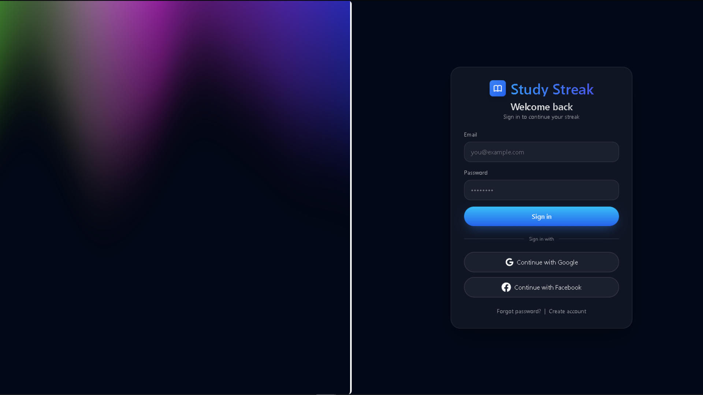
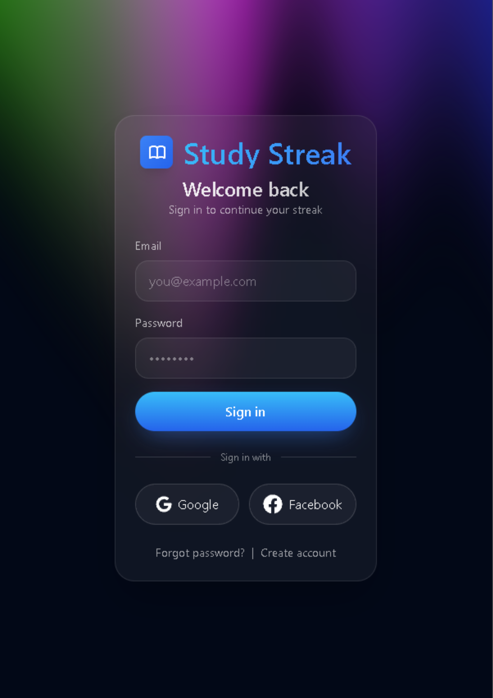

# 📚 StudyStreak

<div align="center">


**Your Ultimate Study Companion with Gamification, AI-Powered Learning, and Smart Focus Management**

[](https://reactjs.org/)
[](https://www.typescriptlang.org/)
[](https://vitejs.dev/)
[](https://www.php.net/)
[](https://www.python.org/)
[](https://supabase.com/)

</div>

---

## 🌟 About StudyStreak

**StudyStreak** is a comprehensive study management platform that combines productivity tools, gamification mechanics, and AI-powered learning features to help students maximize their learning potential. Built with modern web technologies, StudyStreak transforms the studying experience into an engaging, trackable, and rewarding journey.

### 🎯 Core Philosophy

- **Track Everything**: Monitor your study sessions, materials, and progress in real-time
- **Stay Motivated**: Gamification with streaks, XP, levels, and achievements
- **Focus Better**: Built-in Pomodoro timer and distraction-free study mode
- **Learn Smarter**: AI-powered quiz generation and content analysis
- **Stay Organized**: Comprehensive task management and study planning tools

---

## ✨ Features

### 📊 **Dashboard**
- **Real-time Progress Tracking**: See today's study time vs goals with visual progress indicators
- **Streak Status**: TikTok-inspired streak system with tier-based colors and animations (🔥 0-9 days gray, 10-29 orange, 30-49 rose, 50-99 purple, 100+ gold)
- **Recent Session Summary**: Quick view of your last focus sessions
- **Study Heat Map**: GitHub-style calendar showing daily activity intensity
- **Quick Stats**: Sessions completed, average focus score, total study hours

### ⏱️ **Focus Session (Pomodoro Timer)**
- **Customizable Intervals**: 25/5 default or custom work/break durations
- **Focus Mode**: Distraction-free dark mode environment
- **Session Goal Setting**: Define objectives before starting
- **Material Integration**: Quick-access panel for notes, PDFs, and quizzes
- **Focus Metrics**: Post-session analytics with focus scores (0-100)
- **Automatic Streak Activation**: Completions automatically update your daily streak

### 🎯 **My Study Plan**
- **Smart To-Do Lists**: Checkbox tasks with deadlines and priority levels
- **Goal Management**: Set and track weekly/monthly study hour targets
- **Calendar View**: Color-coded schedule for different subjects
- **Notification Center**: Grouped reminders and deadline alerts
- **Priority System**: Drag-and-drop task organization

### 📚 **Learning Materials**
- **Official Courses**: Admin-provided modules with progress tracking
- **Community Library**: User-shared notes, flashcards, and summaries
- **My Materials**: Personal uploads with AI-generated quizzes
- **File Support**: PDF and PowerPoint presentations (up to 50MB)
- **Smart Search**: Filter by subject, difficulty, type, or tags
- **In-App Preview**: View PDFs and presentations without leaving the app

### 🏆 **Gamification System**
- **XP & Levels**: Earn experience points and level up
- **Daily Streaks**: Build and maintain study streaks with visual fire indicators
- **Streak Savers**: Grace periods when you miss a day
- **Achievement Badges**: Unlock rewards for reaching milestones
- **Progress Visualization**: Beautiful charts showing your growth over time
- **Timezone-Aware**: Accurate streak tracking regardless of location

### 📈 **Progress & Analytics**
- **Detailed Charts**: Study hours breakdown by day/week/month
- **Streak History Calendar**: Full GitHub-style activity grid
- **Skill Progression**: Milestone tracking per subject
- **Exportable Reports**: Download PDF/CSV summaries
- **Comparison Analytics**: Focus level, session time, and task completion trends

### 👤 **Profile & Settings**
- **Personalization**: Custom themes, timer sounds, language settings
- **Account Management**: Password reset, linked accounts
- **Notification Preferences**: Email and in-app reminders
- **Privacy Controls**: Manage visibility of profile and shared materials
- **Dark Mode**: Beautiful dark theme optimized for focus sessions

### 🤖 **AI-Powered Features**
- **Automatic Quiz Generation**: AI creates quizzes from your uploaded materials
- **Content Analysis**: Extract text from PDFs and presentations
- **Smart Recommendations**: Get personalized study suggestions (coming soon)

### 📱 **Progressive Web App (PWA)**
- **Install on Any Device**: Works like a native app on desktop and mobile
- **Offline Support**: Access cached content without internet
- **Push Notifications**: Stay updated with reminders and achievements
- **Responsive Design**: Seamless experience across all screen sizes

---

## 🛠️ Tech Stack

### **Frontend**
- **React 19.1.1** - Modern UI library with concurrent features
- **TypeScript 5.9.2** - Type-safe development
- **Vite 7.1.2** - Lightning-fast build tool and dev server
- **React Router 7.9.1** - Client-side routing
- **Tailwind CSS 3.4.17** - Utility-first CSS framework
- **Framer Motion 12.23** - Animation library
- **Radix UI** - Accessible component primitives
- **Lucide React** - Beautiful icon library
- **OGL** - WebGL library for advanced graphics

### **Backend (PHP Middleware)**
- **PHP 8.x** - Server-side scripting
- **Guzzle 7.10** - HTTP client for Supabase integration
- **Firebase JWT 6.0** - Token authentication
- **Composer** - Dependency management
- **Docker** - Containerization

### **AI Service**
- **Python 3.11+** - Core language
- **FastAPI 0.115** - Modern API framework
- **Uvicorn** - ASGI server
- **PyPDF 4.3** - PDF text extraction
- **python-pptx 0.6** - PowerPoint processing
- **httpx 0.27** - Async HTTP client

### **Backend as a Service**
- **Supabase** - PostgreSQL database, authentication, and storage
  - Real-time subscriptions
  - Row-level security
  - Storage buckets for file uploads
  - Auth with JWT tokens

### **DevOps & Tools**
- **Docker & Docker Compose** - Container orchestration
- **ESLint** - JavaScript/TypeScript linting
- **PostCSS & Autoprefixer** - CSS processing
- **Vite PWA Plugin** - Progressive Web App capabilities

---

## 🚀 Getting Started

### Prerequisites

- **Node.js** 18+ and npm
- **PHP** 8.0+ with Composer
- **Python** 3.11+ with pip
- **Docker & Docker Compose** (recommended)
- **Supabase Account** (free tier available)

### 1️⃣ Clone the Repository

```bash
git clone https://github.com/gableee/Studystreak.git
cd Studystreak
```

### 2️⃣ Set Up Supabase

1. Create a new project at [supabase.com](https://supabase.com)
2. Note your project URL and anon key from Settings → API
3. Set up the database schema (tables for profiles, study sessions, materials, etc.)
4. Configure storage buckets for file uploads

### 3️⃣ Configure Environment Variables

#### **Frontend** (`studystreak/.env.local`)
```env
VITE_SUPABASE_URL=https://your-project.supabase.co
VITE_SUPABASE_ANON_KEY=your-anon-key
VITE_API_BASE_URL=http://localhost:8181
```

#### **PHP Backend** (`php-backend/.env`)
```env
SUPABASE_URL=https://your-project.supabase.co
SUPABASE_ANON_KEY=your-anon-key
SUPABASE_SERVICE_ROLE_KEY=your-service-role-key
API_ALLOWED_ORIGINS=http://localhost:5173,http://localhost:5174
SUPABASE_STUDY_SESSION_TABLE=studysession
```

#### **AI Service** (`ai-service/.env`)
```env
SUPABASE_URL=https://your-project.supabase.co
SUPABASE_SERVICE_ROLE_KEY=your-service-role-key
```

### 4️⃣ Run with Docker (Recommended)

```bash
# Start all services
cd docker
docker compose up --build

# Services will be available at:
# - Frontend: http://localhost:5173 (if running separately)
# - PHP Backend: http://localhost:8181
```

### 5️⃣ Run Locally (Alternative)

#### **Backend Setup**
```bash
cd php-backend
composer install
php -d upload_max_filesize=60M -d post_max_size=65M -S 127.0.0.1:8181 -t public
```

#### **Frontend Setup**
```bash
cd studystreak
npm install
npm run dev
# Access at http://localhost:5173
```

#### **AI Service Setup**
```bash
cd ai-service
pip install -r requirements.txt
uvicorn main:app --reload --port 8000
# Access at http://localhost:8000
```

---

## 📁 Project Structure

```
Studystreak/
├── studystreak/              # React frontend application
│   ├── src/
│   │   ├── Application/      # Core app components (Layout, Navigation)
│   │   ├── Auth/             # Authentication pages and logic
│   │   ├── Features/         # Main feature modules
│   │   │   ├── Dashboard/
│   │   │   ├── FocusSession/
│   │   │   ├── LearningMaterials/
│   │   │   ├── MyStudyPlan/
│   │   │   ├── ProgressAnalytics/
│   │   │   ├── AchievementsRewards/
│   │   │   ├── Gamification/
│   │   │   └── Profile/
│   │   ├── components/       # Shared UI components
│   │   ├── lib/              # Utilities and helpers
│   │   └── assets/           # Images, icons, styles
│   ├── public/               # Static assets
│   ├── package.json
│   └── vite.config.ts
│
├── php-backend/              # PHP middleware layer
│   ├── src/
│   │   ├── Controllers/      # API endpoint handlers
│   │   ├── Middleware/       # Auth and CORS middleware
│   │   ├── Services/         # Business logic (Storage, etc.)
│   │   ├── Auth/             # Supabase authentication wrapper
│   │   └── Config/           # Configuration classes
│   ├── public/
│   │   └── index.php         # Entry point
│   ├── composer.json
│   └── README.md
│
├── ai-service/               # Python AI microservice
│   ├── main.py               # FastAPI application
│   ├── utils/
│   │   ├── extract_text.py   # PDF/PPTX text extraction
│   │   └── generate_quiz.py  # AI quiz generation
│   └── requirements.txt
│
├── docker/                   # Docker configuration
│   ├── docker-compose.yml
│   └── Dockerfile
│
├── .github/                  # GitHub Actions workflows
├── .vscode/                  # VS Code settings
├── GAMIFICATION_REDESIGN.md  # Detailed gamification docs
├── refactor-todo.md          # Development roadmap
└── README.md                 # This file
```

---

## 🏗️ Architecture Overview

```
┌─────────────────┐
│   React App     │ ← User Interface (Vite + React + TypeScript)
│  (Port 5173)    │
└────────┬────────┘
         │
         ↓ API Calls
┌─────────────────┐
│  PHP Middleware │ ← Authentication & Request Proxying
│  (Port 8181)    │
└────────┬────────┘
         │
         ├─→ Supabase REST API (Database + Auth)
         ├─→ Supabase Storage (File Uploads)
         └─→ Python AI Service (Port 8000)
                ↓
            Quiz Generation & Content Analysis
```

### **Request Flow**

1. **User interacts** with React frontend
2. **Frontend sends** authenticated requests to PHP backend
3. **PHP middleware**:
   - Validates JWT tokens with Supabase
   - Applies CORS policies
   - Proxies requests to Supabase or AI service
4. **Supabase handles**:
   - Database operations (PostgreSQL)
   - Real-time subscriptions
   - File storage
   - User authentication
5. **AI Service processes**:
   - Material uploads
   - Text extraction from PDFs/PPTX
   - Quiz generation

---

## 🎮 Key Features in Detail

### **Streak System**
The streak system is inspired by social media engagement patterns:
- **Active Streak**: Shown with full color and animated flame when you've studied today
- **Inactive Streak**: Grayed out flame when you haven't studied yet
- **Tier Colors**: Progress through gray → orange → rose → purple → gold as you build your streak
- **Timezone-Aware**: Accurate daily tracking regardless of your location
- **Streak Savers**: Grace periods to protect your streak on busy days

### **Gamification Mechanics**
- **XP System**: Earn experience points for every study activity
- **Level Progression**: Level up as you accumulate XP
- **Achievement Badges**: Unlock rewards at milestone moments
- **Progress Tracking**: Detailed analytics of your study habits

### **Focus Session Flow**
1. Select study materials from your library
2. Set your Pomodoro interval (default: 25 min work, 5 min break)
3. Choose a session goal
4. Start timer and enter focus mode
5. System tracks your focus and awards XP upon completion
6. Automatic streak activation after successful sessions

---

## 🧪 API Documentation

### **PHP Backend Endpoints**

#### Gamification
- `GET /api/gamification/profile` - Fetch user stats (level, XP, streak)
- `POST /api/gamification/streak/activate` - Update daily streak
- `POST /api/gamification/streak/use-saver` - Use a streak saver
- `POST /api/gamification/set-timezone` - Update user timezone

#### Learning Materials
- `GET /api/learning-materials` - List all materials
- `POST /api/learning-materials` - Upload new material
- `GET /api/learning-materials/:id` - Get material details
- `DELETE /api/learning-materials/:id` - Delete material

#### To-Do Lists
- `GET /api/todos` - List todos
- `POST /api/todos` - Create todo
- `PUT /api/todos/:id` - Update todo
- `DELETE /api/todos/:id` - Delete todo

Full interactive API documentation is available at `/docs` when the backend is running.

---

## 🤝 Contributing

Contributions are welcome! Here's how you can help:

### Development Workflow

1. **Fork the repository**
2. **Create a feature branch**
   ```bash
   git checkout -b feature/amazing-feature
   ```
3. **Make your changes**
   - Follow existing code style and conventions
   - Write meaningful commit messages
   - Add tests if applicable
4. **Test thoroughly**
   ```bash
   cd studystreak
   npm run lint
   npm run build
   ```
5. **Commit and push**
   ```bash
   git commit -m "Add amazing feature"
   git push origin feature/amazing-feature
   ```
6. **Open a Pull Request**

### Code Style

- **Frontend**: Follow ESLint rules configured in the project
- **Backend**: Follow PSR-12 PHP coding standards
- **Python**: Follow PEP 8 style guide
- **Commits**: Use conventional commit messages

### Areas for Contribution

- 🐛 Bug fixes and improvements
- ✨ New features and enhancements
- 📚 Documentation improvements
- 🎨 UI/UX enhancements
- 🧪 Test coverage
- 🌐 Internationalization (i18n)
- ♿ Accessibility improvements

---

## 📝 Development Roadmap

### ✅ Completed
- Dashboard with real-time stats
- Pomodoro timer with focus tracking
- Gamification system with streaks and XP
- Learning materials management
- AI-powered quiz generation
- PWA support
- Responsive design

### 🚧 In Progress
- Repository pattern for cleaner backend code
- PHPUnit test coverage
- Signed URL refresh mechanism
- Pagination for material libraries

### 🔜 Coming Soon
- Leaderboards and social features
- Advanced analytics and insights
- Mobile app (React Native)
- Browser extension for focus mode
- Spaced repetition system
- Collaborative study rooms
- Smart study recommendations

---

## 🐛 Troubleshooting

### Frontend Issues

**Problem**: Blank screen or "Cannot connect to server"
- **Solution**: Ensure `VITE_API_BASE_URL` is set correctly and backend is running

**Problem**: Authentication fails
- **Solution**: Check Supabase credentials in `.env.local` are correct

### Backend Issues

**Problem**: CORS errors
- **Solution**: Add your frontend URL to `API_ALLOWED_ORIGINS` in backend `.env`

**Problem**: File upload fails
- **Solution**: Check PHP upload limits in `php.ini` or Docker command

### Database Issues

**Problem**: Connection errors
- **Solution**: Verify Supabase project is active and credentials are valid

---

## 📄 License

This project is currently unlicensed. All rights reserved by the author.

---

## 👨‍💻 Author

**Gabriel (Gable)**
- GitHub: [@gableee](https://github.com/gableee)
- Project: [StudyStreak](https://github.com/gableee/Studystreak)

---

## 🙏 Acknowledgments

- **Supabase** - For providing an excellent backend-as-a-service platform
- **Vercel** - For seamless frontend hosting
- **Render** - For reliable backend deployment
- **Open Source Community** - For the amazing tools and libraries

---

## 📸 Screenshots

<div align="center">

### Dashboard View


### Mobile Experience


</div>

---

<div align="center">

**Made with ❤️ and ☕ by students, for students**

⭐ Star this repo if you find it helpful! ⭐

</div>
